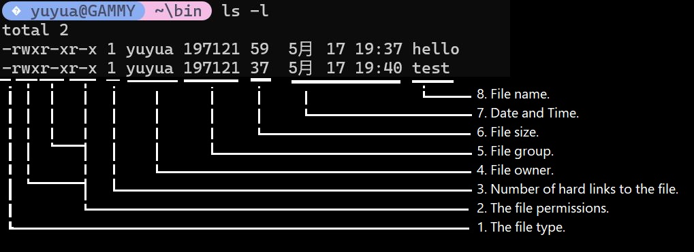

- force case insensitive: #bash #parameter #pattern-matching
  collapsed:: true
	- ```bash
	  shopt -s nocasematch # enable no case match
	  shopt -u nocasematch # disable no case match (bash default)
	  ```
	- https://linuxbash.sh/post/force-case-insensitive-matching-in-varvar-via-shopt--s-nocasematch
- auto transform input to upper/lower case #bash #parameter #pattern-matching
	- ```bash
	  echo "You typed: ${userInput^^}" # Upper case: ${var^^}
	  echo "Your current shell: ${SHELL,,}" # Lower case: ${var,,}	
	  ```
	- https://linuxbash.sh/post/force-case-insensitive-matching-in-varvar-via-shopt--s-nocasematch
	-
- passing function arg #bash #function
  collapsed:: true
	- ```bash 
	  function_name ($1, $2...) {}
	  function_name "$arg1" "$arg2"
	  ```
	- https://stackoverflow.com/questions/6212219/passing-parameters-to-a-bash-function
	-
- diff between print & echo #bash
  collapsed:: true
	- #+BEGIN_QUOTE
	  echo -e interprets escape sequences on Linux but may not on macOS, and echo -n behavior varies between implementations. printf is consistent everywhere because it is defined by POSIX with precise format semantics
	  #+END_QUOTE
	- #+BEGIN_QUOTE
	   on macOS with /bin/sh (dash), echo -e "...\n..." would print the literal string -e Line 1\nLine 2\nLine 3. This is the portability trap.
	  #+END_QUOTE
	- https://www.commandinline.com/bash-printf-vs-echo-comparison/
		-
- base case arguments #bash #case
  collapsed:: true
	- https://linuxize.com/post/bash-case-statement/
	-
- base64 encoding #bash #encode
  collapsed:: true
	- https://linuxsimply.com/bash-scripting-tutorial/string/manipulation/base64-encode-decode/
	- ```bash
	  echo -n 'Sample string' | base64 #Encode text incorporating pipe command
	  base64 file1.txt #Encode with text file
	  base64 file2.txt > encoded_file.txt #Encode and save encoded text to a file
	  echo 'Long string.' | base64 -w 0 #Encode with defualt 76 characters line wrap
	  base64 -d encodedfile.txt #Decode text file
	  echo 'String with non-alphabet characters' | base64 -i #Encode text ignoring non-alphabet character
	  ```
- global cli #bash #env #--gobal
  collapsed:: true
	- edits the new path variable in .profile or .bash_profile; remember to reload to apply the change
	  logseq.order-list-type:: number
		- ```bash
		  export PATH=$PATH":$HOME/bin"
		  ```
	- 2. create the directory "bin" under the home dir "~/bin"
	- 3. create the script under "bin", the **FULL** script file name <scriptname>(.<extension>), will be the global command line
	- 4. give the execute permission to the script
		- ```cmd
		  $ chmod +x <scriptname>.(<extension>)
		  ```
	- 5. now from any directory one can achieve
		- ```cmd
		  $ hello
		  hello world!
		  ```
	- *!* its recommend to not use .<extension> for the script, bc .<extension> will be required for the script to execute
		- ```shell
		  #EXAMPLE 1:
		  ~/bin/hello.sh
		  $ chmod +x hello.sh
		  $ hello.sh # OUTPUT: hello world!
		  
		  #EXAMPLE 2:
		  ~/bin/hello
		  $ chmod +x hello
		  $ hello # OUTPUT: hello world!
		  ```
	-
	-
- chmod & ls to operate on file permissions #bash #ls #chmod
  collapsed:: true
	- https://linuxize.com/post/how-to-list-files-in-linux-using-the-ls-command/
	- https://quickref.me/chmod.html
	- https://linuxize.com/post/chmod-command-in-linux/
	- ```bash
	  $ ls #diplay all files and diretory
	  $ ls -d */ #list immediate sub folder
	  
	  $ ls -l #display long details 
	  $ ls -F #appends a character to each entry that indicates its type
	  $ ls -a #show hidden files
	  $ ls -R #List subdirectories recursively
	  $ ls -1 #one entry per line
	  $ ls -d #Show the current dir info (similar to 'pwd') instead of contents
	  ```
	- ```cmd
	  $ ls -l
	  total 2
	  -rwxr-xr-x 1 yuyua 197121 59  5月 17 19:37 hello
	  -rwxr-xr-x 1 yuyua 197121 37  5月 17 19:40 test
	  ```
	- {:height 273, :width 728}
	- ```
	  d  rwx  r-x  r-x
	  ┬  ─┬─  ─┬─  ─┬─  
	  │   │    │    │  
	  │   │    │    └─ 4. Other｜5 (4+0+1)
	  │   │    └────── 3. Group｜5 (4+0+1)
	  │   └─────────── 2. User ｜7 (4+2+1)
	  └─────────────── 1. File Type | directory
	  ```
	-
- TODO ls filter files by type & find #bash #linux #ls
  collapsed:: true
	- https://linuxvox.com/blog/list-of-all-folders-and-sub-folders/
	- https://www.baeldung.com/linux/ls-files-by-type
	- https://unix.stackexchange.com/questions/165455/how-can-i-list-files-by-type-with-ls
	-
- TODO bash wait for async~ functions #bash #function #workflow
  collapsed:: true
	- https://linuxize.com/post/bash-wait/
	- there is no async function in bash script, if one wish to execute functions in a row and have control over which function finished and when to move on, "wait" & "sleep" can be helpful for the workflow control
	- ```bash
	  $ wait [options] ID...#"wait" is specific for background job to compplete
	  $ sleep [amount] #"sleep" work with set amount of time
	  ```
	- ```bash
	  my_function & wait $!
	  ```
	- 
	- https://stackoverflow.com/questions/10028820/bash-wait-with-timeout
	- https://linuxize.com/post/bash-wait/
	- https://stackoverflow.com/questions/2398388/is-it-possible-for-bash-commands-to-continue-before-the-result-of-the-previous-c
- TODO bash export #bash
  collapsed:: true
	- https://linuxize.com/post/export-command-in-linux/
	- https://www.computerhope.com/unix/bash/export.htm
	- https://stackoverflow.com/questions/10822790/can-i-call-a-function-of-a-shell-script-from-another-shell-script
- TODO bash loop control #bash #loop
  collapsed:: true
	- https://linuxvox.com/blog/bash-break-and-continue/#what-is-break
	- https://linuxize.com/post/bash-break-continue/
	-
- TODO Backup and Sync Operations #bash
  collapsed:: true
	- https://linuxcapable.com/bash-wait-command/
- TODO BASH CHEATSHEET&BASIC #bash
  collapsed:: true
	- https://www.gnu.org/savannah-checkouts/gnu/bash/manual/bash.html
	- https://www.geeksforgeeks.org/linux-unix/bash-script-define-bash-variables-and-its-types/
- TODO bash jq & json object & array #bash #json
  collapsed:: true
	- https://www.baeldung.com/linux/jq-command-json
	- https://www.baeldung.com/linux/jq-add-objects-json-array
- TODO bash pipe #bash #pipe
  collapsed:: true
	- https://linuxsimply.com/bash-scripting-tutorial/redirection-and-piping/piping/
	- https://stackoverflow.com/questions/9834086/what-is-a-simple-explanation-for-how-pipes-work-in-bash
	- https://stackoverflow.com/questions/11279335/bash-write-to-file-without-echo
- TODO passing string as file #bash #pipe
  collapsed:: true
	- https://unix.stackexchange.com/questions/505828/how-to-pass-a-string-to-a-command-that-expects-a-file
	- https://unix.stackexchange.com/questions/16990/using-data-read-from-a-pipe-instead-than-from-a-file-in-command-options
- TODO regular expression #bash #parameter
  collapsed:: true
	- https://regex101.com/list-substitution
- TODO bash awk #bash #pattern-matching
  collapsed:: true
	- https://www.geeksforgeeks.org/linux-unix/awk-command-unixlinux-examples/
- TODO bash read user input/prompt #bash #prompt
  collapsed:: true
	- https://www.geeksforgeeks.org/linux-unix/bash-script-read-user-input/
- TODO bash write to file #bash
  collapsed:: true
	- https://linuxize.com/post/bash-write-to-file/
	- ```bash
	  $ command > file.txt #Write to file (overwrite)
	  $ command >> file.txt #Append to file
	  $ printf "this is a file\nthis is the second line." > file.txt 
	  $ echo -e "this is a file\nthis is the second line." > file.txt #the \n may not register in macOS
	  $ set -o noclobber #Prevent overwriting
	  $ command >| file.txt #Override noclobber
	  $ cat << EOF > file.txt #Write multiple lines # type "EOF" to end the editor
	  $ command | tee file.txt #Write with tee	
	  $ command | tee -a file.txt #Append with tee
	  $ command | sudo tee file.txt #Write as root
	  ```
	- #+BEGIN_QUOTE
	  What is the difference between > and >>?
	  The > operator overwrites the file with the new output. The >> operator appends the output to the end of the existing file without removing its contents.
	  #+END_QUOTE