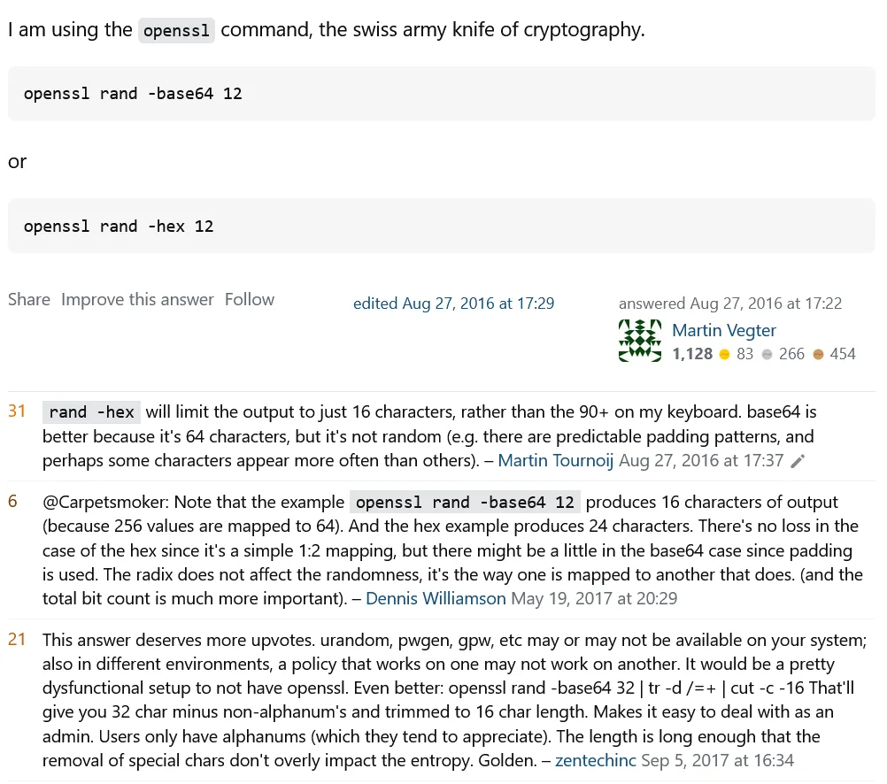
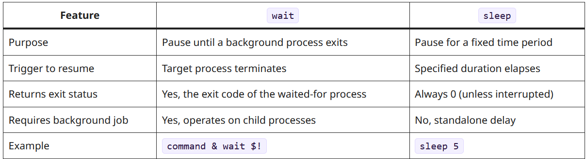

- TODO find & grep & awk #bash #pattern-matching
  id:: 6a09e600-6703-4a04-85ab-44311391f007
  collapsed:: true
  :LOGBOOK:
  CLOCK: [2026-05-18 Mon 02:34:44]--[2026-05-18 Mon 02:34:44] =>  00:00:00
  CLOCK: [2026-05-18 Mon 02:34:45]--[2026-05-18 Mon 02:34:46] =>  00:00:01
  CLOCK: [2026-05-18 Mon 02:34:46]--[2026-05-18 Mon 02:34:49] =>  00:00:03
  CLOCK: [2026-05-18 Mon 02:52:43]--[2026-05-18 Mon 02:52:46] =>  00:00:03
  CLOCK: [2026-05-18 Mon 02:57:31]--[2026-05-18 Mon 02:57:33] =>  00:00:02
  CLOCK: [2026-05-18 Mon 02:57:35]--[2026-05-18 Mon 02:57:35] =>  00:00:00
  :END:
	- https://www.geeksforgeeks.org/linux-unix/grep-command-in-unixlinux/
	- https://www.geeksforgeeks.org/linux-unix/awk-command-unixlinux-examples/
	- https://linuxvox.com/blog/list-of-all-folders-and-sub-folders/
	- https://www.baeldung.com/linux/ls-files-by-type
	- https://unix.stackexchange.com/questions/165455/how-can-i-list-files-by-type-with-ls
- TODO linux generate ramdom string #linux #generate-string
  collapsed:: true
  :LOGBOOK:
  CLOCK: [2026-05-18 Mon 02:33:16]--[2026-05-18 Mon 02:34:08] =>  00:00:52
  :END:
	- https://stackoverflow.com/questions/10822790/can-i-call-a-function-of-a-shell-script-from-another-shell-script
	- ```bash
	  cat /dev/urandom | tr -dc 'a-zA-Z0-9' | fold -w 22 |head -n 1 # length 22, take line 1, have only a-zA-Z0-9 chars
	  ```
	- ```bash
	  openssl rand -base64 12 #not true random, can be usually end with '=='
	  ```
	- 
- TODO bash wait for async~ functions #bash #function #workflow
  collapsed:: true
	- https://linuxize.com/post/bash-wait/
	- there is no async function in bash script, if one wish to execute functions in a row and have control over which function finished and when to move on, "wait" & "sleep" can be helpful for the workflow control
	- ```bash
	  $ wait [options] ID...#"wait" is specific for background job to compplete
	  $ sleep [amount] #"sleep" work with set amount of time
	  ```
	- ```bash
	  my_function & wait $!
	  ```
	- 
	- https://stackoverflow.com/questions/10028820/bash-wait-with-timeout
	- https://linuxize.com/post/bash-wait/
	- https://stackoverflow.com/questions/2398388/is-it-possible-for-bash-commands-to-continue-before-the-result-of-the-previous-c
- TODO bash export #bash #export #pathing
  collapsed:: true
	- https://linuxize.com/post/export-command-in-linux/
	- https://www.computerhope.com/unix/bash/export.htm
	- https://stackoverflow.com/questions/10822790/can-i-call-a-function-of-a-shell-script-from-another-shell-script
	- ```bash
	  export -p #list all exported variables
	  #OUTPUT: 
	  # declare -x HOME="/c/Users/yuyua"
	  # declare -x SHELL="/usr/bin/bash"
	  # declare -x USERDOMAIN="GAMMY"
	  # declare -x USERDOMAIN_ROAMINGPROFILE="GAMMY"
	  # declare -x USERNAME="yuyua"
	  # declare -x USERPROFILE="C:\\Users\\yuyua"
	  # declare -x checker="echo 'this is a checker'" 
	  	#⬆this is from .bash_profile, once added, remove it from .bash_profile wont remove it form the sys
	  ```
	- ```bash
	  SCRIPT_DIR=$( cd -- "$( dirname -- "${BASH_SOURCE[0]}" )" &> /dev/null && pwd )
	  echo "$SCRIPT_DIR" # OUTPUT: /d/work/v2pen
	  source $SCRIPT_DIR/build.sh
	  
	  source "$(dirname "$0")/build.sh" 
	  # OUTPUT: bash: /usr/bin/build.sh: No such file or directory
	  ```
	-
	-
- TODO bash loop control #bash #loop
  collapsed:: true
	- https://linuxvox.com/blog/bash-break-and-continue/#what-is-break
	- https://linuxize.com/post/bash-break-continue/
	-
- TODO Backup and Sync Operations #bash
  collapsed:: true
	- https://linuxcapable.com/bash-wait-command/
- TODO BASH CHEATSHEET&BASIC #bash
  collapsed:: true
  :LOGBOOK:
  CLOCK: [2026-05-18 Mon 02:34:05]--[2026-05-18 Mon 02:34:06] =>  00:00:01
  CLOCK: [2026-05-18 Mon 02:34:06]--[2026-05-18 Mon 02:34:07] =>  00:00:01
  :END:
	- https://www.gnu.org/savannah-checkouts/gnu/bash/manual/bash.html
	- https://www.geeksforgeeks.org/linux-unix/bash-script-define-bash-variables-and-its-types/
	-
- TODO bash jq & json object & array #bash #json #data-type
  collapsed:: true
	- https://www.baeldung.com/linux/jq-command-json
	- https://www.baeldung.com/linux/jq-add-objects-json-array
- TODO bash pipe #bash #pipe
  collapsed:: true
	- https://linuxsimply.com/bash-scripting-tutorial/redirection-and-piping/piping/
	- https://stackoverflow.com/questions/9834086/what-is-a-simple-explanation-for-how-pipes-work-in-bash
	- https://stackoverflow.com/questions/11279335/bash-write-to-file-without-echo
- TODO passing string as file #bash #pipe #write-file
  collapsed:: true
	- https://unix.stackexchange.com/questions/505828/how-to-pass-a-string-to-a-command-that-expects-a-file
	- https://unix.stackexchange.com/questions/16990/using-data-read-from-a-pipe-instead-than-from-a-file-in-command-options
- TODO regular expression #bash #parameter #pattern-matching
  collapsed:: true
	- https://regex101.com/list-substitution
- TODO bash read user input/prompt #bash #prompt
  collapsed:: true
  :LOGBOOK:
  CLOCK: [2026-05-18 Mon 02:52:51]--[2026-05-18 Mon 02:52:51] =>  00:00:00
  :END:
	- https://www.geeksforgeeks.org/linux-unix/bash-script-read-user-input/
-
-